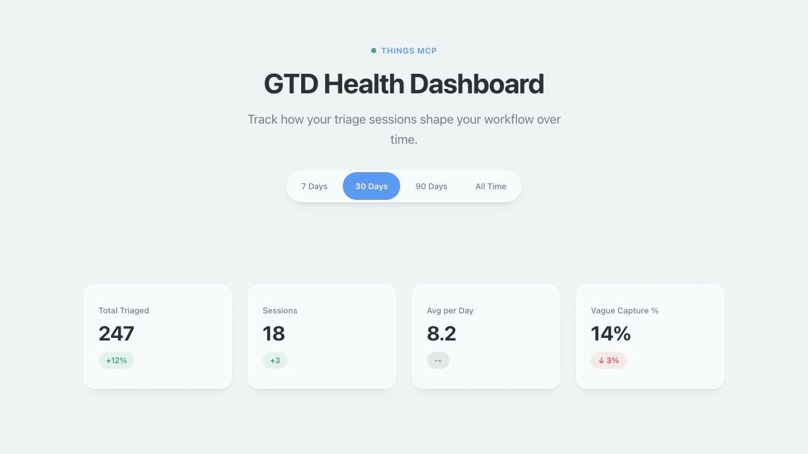
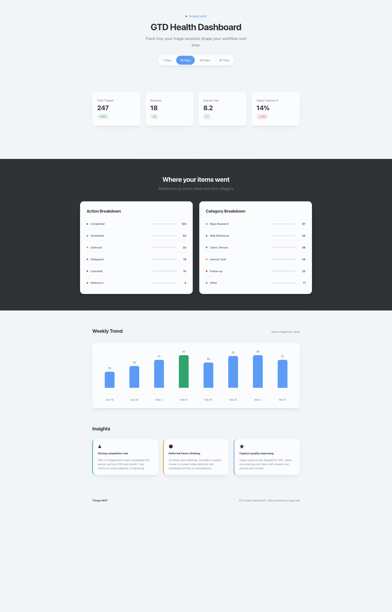

# Things 3 GTD MCP Server

A **Model Context Protocol (MCP) server** for [Things 3](https://culturedcode.com/things/) that brings GTD (Getting Things Done) methodology to AI assistants.

[](https://pypi.org/project/mcp-things/)
[](https://buymeacoffee.com/caseyberlin)

## Installation

```bash
pip install mcp-things
# or run directly without installing:
uvx mcp-things
```

> **Note:** Review the [Privacy Notice](PRIVACY.md) and [Terms of Use](TERMS_OF_USE.md) before installation.

## What Is This?

This MCP server enables AI assistants like Claude to manage your tasks in Things 3 using natural language. But more than just a task API, it's designed around David Allen's **GTD methodology** — helping you capture, clarify, organize, reflect, and engage with your work the way GTD intended.

### The Vision

> "Your head's a crappy office." — David Allen

The goal isn't to expose database operations to an AI. It's to give AI assistants the tools to help you *practice GTD* effectively:

- **Capture** thoughts quickly without organizing
- **Clarify** inbox items with GTD decision guidance
- **Organize** tasks by context, energy, and time available
- **Reflect** with daily and weekly reviews that surface stalled projects
- **Engage** by finding the right task for your current context



## History

This project evolved through several stages:

1. **[things-mcp](https://github.com/hald/things-mcp)** by Harald Lindstrøm — Original MCP implementation exposing Things 3 operations
2. **FastMCP Migration** — Modernized to FastMCP framework with async tools, caching, and reliability features
3. **GTD-Native Tools** — Redesigned from REST-style CRUD operations to intent-based tools aligned with GTD's five stages

The shift from "database wrapper" to "GTD assistant" reflects a key insight about MCP design: **tools should match how agents think about problems**, not how APIs are structured.

## Future Direction

This is an evolving experiment in GTD-native AI tooling. Potential directions:

- **MCP Resources** for ambient GTD state (inbox count, stalled projects)
- **Smarter context detection** based on time, location, calendar
- **GTD coaching** — proactive suggestions during reviews
- **Multi-app GTD** — extending the pattern beyond Things 3

Contributions and ideas welcome.

## Quick Start

### Prerequisites

- **macOS** (required — uses AppleScript and URL schemes)
- **Things 3** with scripting permissions enabled
- **Python 3.12+**
- **uv** package manager

### Installation

```bash
# Clone and install
git clone https://github.com/CaseyRo/mcp-things.git
cd mcp_things
uv pip install -e .

# Configure Things 3 authentication token
python scripts/configure_token.py
```

### Running

```bash
# Production mode (binds to 127.0.0.1:8009)
uv run server

# Development mode with auto-reload
uv run dev
```

On first startup, the server auto-generates a secure API key and saves it to `.env`. The key is printed to the console:

```
  API Key: tmcp_xxxxxxxxxxxxxxxxxxxxxxxxxxxxxxxxxxxxxxxx
  Configure MCP clients with: Authorization: Bearer <key>
```

### Authentication

All MCP endpoints require bearer token authentication. The API key is managed automatically:

- **First run:** A `tmcp_`-prefixed key is generated and saved to `.env` as `THINGS_MCP_API_KEY`
- **Subsequent runs:** The existing key is loaded from `.env`
- **Regenerate:** Delete the `THINGS_MCP_API_KEY=` line from `.env` and restart — a new key is generated
- **Manual set:** Set `THINGS_MCP_API_KEY=your-key` in `.env` before starting

The dashboard at `/dashboard` remains accessible without authentication (it contains only anonymized triage statistics).

### Claude Desktop Integration

First, start the server (it must be running for Claude to connect):

```bash
uv run server
```

Copy the API key from the console output, then add to `~/Library/Application Support/Claude/claude_desktop_config.json`:

```json
{
  "mcpServers": {
    "things": {
      "url": "http://127.0.0.1:8009/mcp",
      "headers": {
        "Authorization": "Bearer tmcp_your-key-here"
      }
    }
  }
}
```

> **Fallback:** If your Claude Desktop version doesn't support `url`, use the mcp-remote bridge:
>
> ```json
> {
>   "mcpServers": {
>     "things": {
>       "command": "npx",
>       "args": ["mcp-remote", "--header", "Authorization: Bearer tmcp_your-key-here", "http://127.0.0.1:8009/mcp"]
>     }
>   }
> }
> ```

### Claude Code Integration

```bash
claude mcp add --transport http --header "Authorization: Bearer tmcp_your-key-here" things http://127.0.0.1:8009/mcp
```

## GTD Tools

The server provides **21 GTD-native tools** organized by methodology stage:

### Capture

| Tool | Purpose |
|------|---------|
| `capture-task` | Quick capture to Inbox without organizing |

### Clarify

| Tool | Purpose |
|------|---------|
| `process-inbox` | Process oldest inbox item with GTD decision guidance |
| `convert-to-project` | Transform a task into a multi-step project |

### Organize

| Tool | Purpose |
|------|---------|
| `schedule-task` | Create organized tasks with context, dates, projects |
| `delegate-task` | Mark task as "Waiting For" with person and follow-up |
| `defer-task` | Move to Someday/Maybe or schedule for future date |
| `modify-task` | Update task properties (title, notes, tags, cancel) |
| `plan-project` | Create project with initial tasks atomically |
| `create-area` | Create a new area of responsibility |

### Reflect

| Tool | Purpose |
|------|---------|
| `daily-review` | Today's tasks, overdue items, inbox status |
| `weekly-review` | Stalled projects, waiting-for items, triage activity |
| `triage-insights` | Analyze triage patterns and trends |

### Engage

| Tool | Purpose |
|------|---------|
| `get-tasks` | Context-first task retrieval (replaces 7 view tools) |
| `focus-mode` | Get single most important task for current context |
| `complete-task` | Mark task done by ID or fuzzy title match |

Plus `search-tasks`, `triage-insights`, `create-area`, `get-projects`, `get-areas`, `get-tags`, `show-in-app`, and `get-cache-stats`.

## GTD Health Dashboard

The server includes a built-in dashboard at `/dashboard` that tracks your inbox triage patterns over time.



**Features:**

- KPI cards: total triaged, sessions, avg/day, vague capture rate
- Action breakdown: completed, canceled, deferred, delegated
- Category breakdown: repo-research, web-reference, client-person, and more
- Weekly trend chart
- Actionable insights based on your triage behavior
- Period selector (7 days, 30 days, 90 days, all time)

Access it at `http://<host>:<port>/dashboard` when the server is running.

### GTD Context Tags

For best results, use consistent GTD tags in Things 3:

```
Contexts: @computer, @phone, @office, @home, @errands, @anywhere
Energy:   high-energy, low-energy
Time:     5min, 15min, 30min, 1hr+
Status:   waiting-for
People:   @person-name (for agenda items)
```

## Repository Structure

| File/Directory | Purpose |
|----------------|---------|
| `README.md` | This file — project overview and quick start |
| `docs/` | Documentation (DEVELOPERS.md, CLAUDE.md, MIGRATION.md, TESTING.md, compatibility guides) |
| `openspec/` | Spec-driven development framework and change proposals |
| `src/things_mcp/` | Main source code |
| `tests/` | Test suite (unit + integration) |
| `scripts/` | Utility scripts (configure_token.py, run_tests.sh, etc.) |
| `PRIVACY.md` | Privacy notice |
| `TERMS_OF_USE.md` | Terms of use |
| `CHANGELOG.md` | Version history |

### Key Source Files

```
src/things_mcp/
├── fast_server.py        # Entry point, ASGI app, dashboard endpoint
├── server_core.py        # Server factory, client middleware, schema transforms
├── auth.py               # Bearer token auth (BearerTokenVerifier for FastMCP)
├── input_validation.py   # Input validation (tag names, show-in-app IDs)
├── tools_gtd_core.py     # Engage/Capture/Clarify tools
├── tools_gtd_organize.py # Organize stage tools
├── tools_gtd_reflect.py  # Reflect stage tools
├── tools_utility.py      # Utility tools (search, list, insights)
├── triage_tracker.py     # Triage action recording and analytics
├── dashboard.html        # GTD Health Dashboard (Cultured Code style)
├── url_scheme.py         # Things URL scheme builders (write operations)
├── applescript_bridge.py # AppleScript execution layer
├── formatters.py         # Output formatting for responses
├── cache.py              # @cached decorator for read operations
├── utils.py              # Circuit breaker, rate limiter, helpers
└── tag_handler.py        # Auto-creates missing tags
```

### OpenSpec

This project uses **OpenSpec** for spec-driven development. The `openspec/` directory contains:

- `project.md` — Project conventions and architecture
- `AGENTS.md` — Instructions for AI assistants working on changes
- `changes/` — Active and archived change proposals

When planning significant changes, create a proposal in `openspec/changes/<change-id>/` with design docs and requirement specs before implementation.

## Development

For development setup, architecture details, testing, and contribution guidelines, see **[docs/DEVELOPERS.md](docs/DEVELOPERS.md)**.

Quick commands:

```bash
# Run tests (default is CI-safe: excludes Things 3 / real tests)
uv run python -m pytest tests

# Run real integration tests only (Things 3 required, local/deployment)
uv run python -m pytest tests -m real

# Lint and format
uv run ruff check . && uv run ruff format .
```

## Credits

- **[Harald Lindstrøm](https://github.com/hald)** — Original things-mcp
- **[Jonathan Lowin](https://github.com/jlowin)** — FastMCP framework
- **[things.py](https://github.com/thingsapi/things.py)** — Things 3 Python library
- **[David Allen](https://gettingthingsdone.com/)** — GTD methodology
- **[Cultured Code](https://culturedcode.com)** — Things 3

## License

MIT License — see [LICENSE](LICENSE).

## Links

- [GitHub Issues](https://github.com/CaseyRo/mcp-things/issues)
- [FastMCP Documentation](https://gofastmcp.com)
- [Things 3 URL Scheme](https://culturedcode.com/things/support/articles/2803573/)
- [GTD Methodology](https://gettingthingsdone.com/)

---

## Removed Tools

The following legacy CRUD-style tools have been removed in favor of GTD-native tools. If you were using these tools, update your code to use the replacements below:

| Removed Tool | Replacement |
|--------------|-------------|
| `get-inbox` | `get-tasks(list_filter="inbox")` |
| `get-today` | `get-tasks(list_filter="today")` |
| `get-upcoming` | `get-tasks(list_filter="upcoming")` |
| `get-anytime` | `get-tasks(list_filter="anytime")` |
| `get-someday` | `get-tasks(list_filter="someday")` |
| `get-logbook` | `get-tasks(list_filter="logbook")` |
| `get-trash` | `get-tasks(list_filter="trash")` |
| `get-todos` | `get-tasks()` |
| `get-tagged-items` | `get-tasks(tag="tag-name")` |
| `get-recent` | `get-tasks(list_filter="logbook")` |
| `search-todos` | `search-tasks` |
| `search-advanced` | `search-tasks` |
| `search-items` | `search-tasks` |
| `add-todo` | `capture-task` or `schedule-task` |
| `add-project` | `plan-project` |
| `update-todo` | `modify-task` |
| `update-project` | `modify-task` |
| `show-item` | `show-in-app` |

**Why?** The GTD-native tools are designed around how you actually work with tasks, not database operations. Instead of "add a todo", you "capture a thought" or "schedule a task with context". This matches how AI assistants naturally think about task management.
