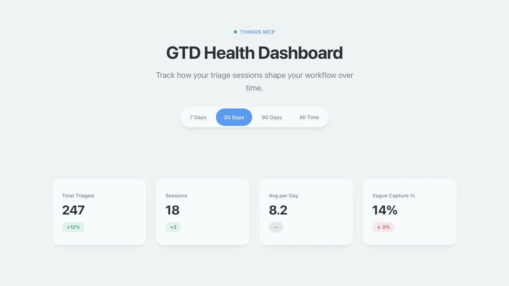
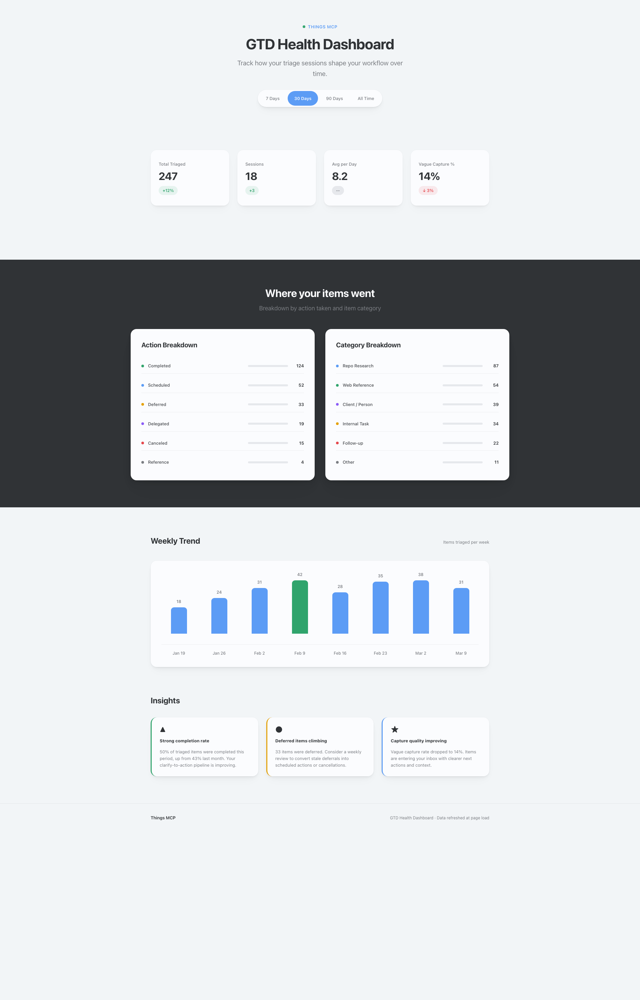

# Things 3 GTD MCP Server

A **Model Context Protocol (MCP) server** for [Things 3](https://culturedcode.com/things/) that brings GTD (Getting Things Done) methodology to AI assistants. It is for Things 3 users on a Mac who want Claude, ChatGPT, n8n or any other MCP client to capture, organize and review their tasks.

This repository is a fork of [excelsier/things-fastmcp](https://github.com/excelsier/things-fastmcp) by Yaroslav Krempovych, which is itself based on [hald/things-mcp](https://github.com/hald/things-mcp) by Harald Lindstrøm. See [History](#history) and [Credits](#credits).

[](https://buymeacoffee.com/caseyberlin)

## Installation

Not published to PyPI (dropped 2026-06). Install from source; see [Quick Start](#quick-start).

> **Note:** Review the [Privacy Notice](PRIVACY.md) and [Terms of Use](TERMS_OF_USE.md) before installation.

## What Is This?

This MCP server enables AI assistants like Claude to manage your tasks in Things 3 using natural language. But more than just a task API, it's designed around David Allen's **GTD methodology** — helping you capture, clarify, organize, reflect, and engage with your work the way GTD intended.

> **Proven at scale.** In a single June 2026 session this server drove a full top-to-bottom cleanup of a 350+ item Things database — classifying every project and task, then executing 109 completions, 36 cancellations, and bulk-routing reference material out to other tools. Across ~150 mutating calls (including 50-item `bulk-complete` / `bulk-cancel` batches) every write landed, with the lone transient HTTP 502 recovering cleanly on an identical retry.

### The Vision

> "Your head's a crappy office." — David Allen

The goal isn't to expose database operations to an AI. It's to give AI assistants the tools to help you *practice GTD* effectively:

- **Capture** thoughts quickly without organizing
- **Clarify** inbox items with GTD decision guidance
- **Organize** tasks by context, energy, and time available
- **Reflect** with daily and weekly reviews that surface stalled projects
- **Engage** by finding the right task for your current context



## History

This project evolved through several stages:

1. **[things-mcp](https://github.com/hald/things-mcp)** by Harald Lindstrøm — Original MCP implementation exposing Things 3 operations
2. **[things-fastmcp](https://github.com/excelsier/things-fastmcp)** by Yaroslav Krempovych: moved to the FastMCP framework with async tools, caching and reliability features (this repo's fork parent)
3. **GTD-Native Tools** — Redesigned from REST-style CRUD operations to intent-based tools aligned with GTD's five stages

The shift from "database wrapper" to "GTD assistant" reflects a key insight about MCP design: **tools should match how agents think about problems**, not how APIs are structured.

## Future Direction

This is an evolving experiment in GTD-native AI tooling. Potential directions:

- **Smarter context detection** based on time, location, calendar
- **GTD coaching** — proactive suggestions during reviews
- **Multi-app GTD** — extending the pattern beyond Things 3

Contributions and ideas welcome.

## Quick Start

### Prerequisites

- **macOS** (required — uses AppleScript and URL schemes)
- **Things 3** with scripting permissions enabled
- **Things URL scheme token** (Things > Settings > General > Enable Things URLs), needed for write tools
- **Python 3.12+** and the **uv** package manager
- **FastMCP 4** (`fastmcp>=4.0.10,<5.0.0`, installed by `uv sync`)

### Installation

```bash
# Clone and install
git clone https://github.com/CaseyRo/mcp-things.git
cd mcp-things
uv sync

# Configure Things 3 authentication token
uv run python scripts/configure_token.py
```

### Running

```bash
# Binds to 127.0.0.1:8009 (`uv run dev` is an alias for the same entry point)
uv run server
```

The MCP endpoint is `http://127.0.0.1:8009/mcp` (streamable HTTP, stateless). `GET /health` and `GET /healthz` return a small JSON status document.

### Running under launchd

The server must run as a native macOS process (not in Docker) because it drives Things through AppleScript and the Things URL scheme. To keep it running, add a LaunchAgent such as `~/Library/LaunchAgents/com.example.mcp-things.plist`:

```xml
<?xml version="1.0" encoding="UTF-8"?>
<!DOCTYPE plist PUBLIC "-//Apple//DTD PLIST 1.0//EN" "http://www.apple.com/DTDs/PropertyList-1.0.dtd">
<plist version="1.0">
<dict>
  <key>Label</key><string>com.example.mcp-things</string>
  <key>ProgramArguments</key>
  <array>
    <string>/path/to/mcp-things/.venv/bin/server</string>
  </array>
  <key>WorkingDirectory</key><string>/path/to/mcp-things</string>
  <key>RunAtLoad</key><true/>
  <key>KeepAlive</key><true/>
</dict>
</plist>
```

Load it with `launchctl bootstrap gui/$(id -u) ~/Library/LaunchAgents/com.example.mcp-things.plist`. Settings are read from `.env` in the working directory. macOS asks for Automation access to Things the first time; the grant is tied to the Python interpreter in `.venv`, so re-grant it if you recreate the environment with a different Python.

### Configuration

Settings come from environment variables or `.env` (see `.env.example`).

| Variable | Default | Purpose |
|----------|---------|---------|
| `THINGS_MCP_HOST` | `127.0.0.1` | Bind address |
| `THINGS_MCP_PORT` | `8009` | Listen port |
| `THINGS_MCP_TRANSPORT` | `streamable-http` | Transport (the only supported value) |
| `THINGS_AUTH_TOKEN` | empty | Things URL scheme token; required for write tools |
| `THINGS_MCP_API_KEY` | auto-generated | Bearer token clients must send (see below) |
| `THINGS_MCP_PUBLIC_URL` | unset | Public HTTPS URL of the server, used as the auth base URL when it sits behind a proxy |
| `THINGS_MCP_DEBUG` | `false` | Verbose console logging |
| `THINGS_MCP_DISABLE_BACKGROUND_OSASCRIPT` | `false` | Bring Things to the foreground during AppleScript calls (debugging) |
| `RETRY_ATTEMPTS` | `3` | Retries for failed operations (1 to 10) |
| `RETRY_DELAY` | `1.0` | Seconds between retries |
| `THINGSDB` | auto-detected | Path to the Things SQLite database |

On first startup, the server auto-generates a secure API key and saves it to `.env`. The key is printed to the console:

```
  API Key: tmcp_xxxxxxxxxxxxxxxxxxxxxxxxxxxxxxxxxxxxxxxx
  Configure MCP clients with: Authorization: Bearer <key>
```

### Authentication

All MCP endpoints require bearer token authentication (`THINGS_MCP_API_KEY`). Write operations additionally require `THINGS_AUTH_TOKEN` (Things app URL scheme token). The API key is managed automatically:

- **First run:** A `tmcp_`-prefixed key is generated and saved to `.env` as `THINGS_MCP_API_KEY`
- **Subsequent runs:** The existing key is loaded from `.env`
- **Regenerate:** Delete the `THINGS_MCP_API_KEY=` line from `.env` and restart — a new key is generated
- **Manual set:** Set `THINGS_MCP_API_KEY=your-key` in `.env` before starting

Only the health endpoints are unauthenticated. To reach the server from another machine, keep it on loopback and put an authenticating tunnel or reverse proxy in front of it; set `THINGS_MCP_PUBLIC_URL` to its public URL.

### Claude Desktop Integration

First, start the server (it must be running for Claude to connect):

```bash
uv run server
```

Copy the API key from the console output, then add to `~/Library/Application Support/Claude/claude_desktop_config.json`:

```json
{
  "mcpServers": {
    "things": {
      "url": "http://127.0.0.1:8009/mcp",
      "headers": {
        "Authorization": "Bearer tmcp_your-key-here"
      }
    }
  }
}
```

> **Fallback:** If your Claude Desktop version doesn't support `url`, use the mcp-remote bridge:
>
> ```json
> {
>   "mcpServers": {
>     "things": {
>       "command": "npx",
>       "args": ["mcp-remote", "--header", "Authorization: Bearer tmcp_your-key-here", "http://127.0.0.1:8009/mcp"]
>     }
>   }
> }
> ```

### Claude Code Integration

```bash
claude mcp add --transport http --header "Authorization: Bearer tmcp_your-key-here" things http://127.0.0.1:8009/mcp
```

## Tool response shape

Every tool returns both a human-readable text block (the existing markdown formatting) and a JSON `structuredContent` envelope so MCP clients can read fields without parsing prose. The envelope is uniform across all 32 tools:

```json
{
  "data": <typed payload | list | null>,
  "summary": "one-sentence headline",
  "meta": {"total_count": 12, "truncated": false, "...": "..."}
}
```

Per-tool payload types are defined in `src/things_mcp/models.py` (`Todo`, `Project`, `Area`, `Tag`, `WriteResult`, `BulkResult`, `FocusResult`, `ReviewReport`, `TriageInsights`, …). Each tool publishes its `outputSchema` in `tools/list`, and the `ClientCompatibilityMiddleware` applies the same anyOf-flattening + ChatGPT strict-mode transforms it does to inputs.

**Migration note for downstream consumers:** if you previously regex-parsed the markdown body (Things URLs, deadline dates, project titles), prefer reading from `structuredContent` going forward. The text block is preserved field-for-field for back-compat, but the JSON envelope is the supported contract.

## GTD Tools

The server provides **32 GTD-native tools** organized by methodology stage:

### Capture

| Tool | Purpose |
|------|---------|
| `capture-task` | Quick capture to Inbox without organizing |

### Clarify

| Tool | Purpose |
|------|---------|
| `process-inbox` | Process oldest inbox item with GTD decision guidance |
| `convert-to-project` | Transform a task into a multi-step project |

### Organize

| Tool | Purpose |
|------|---------|
| `schedule-task` | Create organized tasks with context, dates, projects |
| `delegate-task` | Mark task as "Waiting For" with person and follow-up |
| `defer-task` | Move to Someday/Maybe or schedule for future date |
| `modify-task` | Update task properties (title, notes, tags, cancel) |
| `modify-project` | Update project properties (title, notes, area, complete/cancel) |
| `plan-project` | Create project with initial tasks atomically |
| `create-area` | Create a new area of responsibility (optionally with projects) |
| `modify-area` | Rename an area or update its tags |
| `delete-area` | Remove an area (safety guard: blocks if loose to-dos exist) |
| `merge-areas` | Move all contents from one area to another, then delete source |

### Reflect

| Tool | Purpose |
|------|---------|
| `daily-review` | Today's tasks, overdue items/projects, inbox status |
| `weekly-review` | Stalled projects, unassigned projects, waiting-for items, triage activity |
| `triage-insights` | Analyze triage patterns and trends |

### Engage

| Tool | Purpose |
|------|---------|
| `get-tasks` | Context-first task retrieval (replaces 7 view tools) |
| `focus-mode` | Get single most important task for current context |
| `complete-task` | Mark task done by ID or fuzzy title match |

### Batch

N-item versions of the singular tools for high-throughput cleanups (each returns per-item `succeeded_ids` / `failed_ids`):

| Tool | Purpose |
|------|---------|
| `bulk-capture` | Capture many tasks to the Inbox in one call |
| `bulk-complete` | Complete many tasks by ID |
| `bulk-cancel` | Cancel many tasks by ID |
| `bulk-modify` | Apply the same property changes to many tasks |
| `bulk-triage` | Record triage decisions (complete/cancel/defer/delegate) across many inbox items |

Plus the utility tools `search-tasks`, `get-projects`, `get-project`, `get-areas`, `get-area`, `get-tags`, `show-in-app`, and `get-cache-stats`.

## Resources and Prompts

- Resources: `things://inbox/count`, `things://today`, `things://stalled-projects`, `things://triage/stats`, `things://contexts`, `things://config`
- Prompts: `weekly-review`, `process-inbox-to-zero`, `plan-project`

## GTD Health Dashboard (disabled)

`src/things_mcp/dashboard.html` is a triage-pattern dashboard (KPIs, action and category breakdowns, weekly trend). Its `/dashboard` routes are currently commented out in `fast_server.py`, so it is not served. The same triage data is available through the `triage-insights` tool and the `things://triage/stats` resource.



## GTD Context Tags

For best results, use consistent GTD tags in Things 3:

```
Contexts: @computer, @phone, @office, @home, @errands, @anywhere
Energy:   high-energy, low-energy
Time:     5min, 15min, 30min, 1hr+
Status:   waiting-for
People:   @person-name (for agenda items)
```

## Repository Structure

| File/Directory | Purpose |
|----------------|---------|
| `README.md` | This file — project overview and quick start |
| `docs/` | Documentation (DEVELOPERS.md, MIGRATION.md, TESTING.md, compatibility guides) |
| `CLAUDE.md` | Guidance for AI coding agents working on this repo |
| `openspec/` | Spec-driven development framework and change proposals |
| `src/things_mcp/` | Main source code |
| `tests/` | Test suite (unit + integration) |
| `scripts/` | Utility scripts (configure_token.py, run_tests.sh, etc.) |
| `PRIVACY.md` | Privacy notice |
| `TERMS_OF_USE.md` | Terms of use |
| `CHANGELOG.md` | Version history |

### Key Source Files

```
src/things_mcp/
├── fast_server.py        # Entry point, ASGI app, health endpoints
├── server_core.py        # Server factory, client middleware, schema transforms
├── auth.py               # Bearer token auth (BearerTokenVerifier for FastMCP)
├── input_validation.py   # Input validation (tag names, show-in-app IDs)
├── tools_gtd_core.py     # Engage/Capture/Clarify tools
├── tools_gtd_organize.py # Organize stage tools
├── tools_gtd_reflect.py  # Reflect stage tools
├── tools_utility.py      # Utility tools (search, list, insights)
├── triage_tracker.py     # Triage action recording and analytics
├── dashboard.html        # GTD Health Dashboard (Cultured Code style)
├── url_scheme.py         # Things URL scheme builders (write operations)
├── applescript_bridge.py # AppleScript execution layer
├── formatters.py         # Output formatting for responses
├── cache.py              # @cached decorator for read operations
├── utils.py              # Circuit breaker, rate limiter, helpers
└── tag_handler.py        # Auto-creates missing tags
```

### OpenSpec

This project uses **OpenSpec** for spec-driven development. The `openspec/` directory contains:

- `project.md` — Project conventions and architecture
- `changes/` — Active and archived change proposals

When planning significant changes, create a proposal in `openspec/changes/<change-id>/` with design docs and requirement specs before implementation.

## Development

For development setup, architecture details, testing, and contribution guidelines, see **[docs/DEVELOPERS.md](docs/DEVELOPERS.md)**.

Quick commands:

```bash
uv sync

# Run tests (default is CI-safe: excludes Things 3 / real tests)
uv run pytest

# Run real integration tests only (Things 3 required, local/deployment)
uv run python -m pytest tests -m real

# Lint and format
uv run ruff check . && uv run ruff format .
```

CI (`.github/workflows/ci.yml`) runs `pip-audit`, ruff and the tests as the `test` check, which is required before a pull request can merge into the default branch, `source`.

## Usage Telemetry

A small middleware (`src/things_mcp/usage.py`) writes one JSON line per tool call to stderr: server name, tool name, duration, outcome and MCP protocol version. It never records arguments or results. Tool failures raise `ToolError`, so they are logged with `outcome: error`.

## Releases

Releases are git tags only and are not published to PyPI. After a change lands on `source`, the release workflow runs the tests and a `pip-audit`, then pushes the next `v*` patch tag. No commit bumps the version in `pyproject.toml`.

## Credits

- **[Harald Lindstrøm](https://github.com/hald)**: original [things-mcp](https://github.com/hald/things-mcp)
- **[Yaroslav Krempovych](https://github.com/excelsier)**: [things-fastmcp](https://github.com/excelsier/things-fastmcp), the upstream of this fork
- **[Jonathan Lowin](https://github.com/jlowin)** — FastMCP framework
- **[things.py](https://github.com/thingsapi/things.py)** — Things 3 Python library
- **[David Allen](https://gettingthingsdone.com/)** — GTD methodology
- **[Cultured Code](https://culturedcode.com)** — Things 3

## Support

If this server saves you time, you can [buy me a coffee](https://buymeacoffee.com/caseyberlin).

## License

MIT License, see [LICENSE](LICENSE).

## Links

- [GitHub Issues](https://github.com/CaseyRo/mcp-things/issues)
- [FastMCP Documentation](https://gofastmcp.com)
- [Things 3 URL Scheme](https://culturedcode.com/things/support/articles/2803573/)
- [GTD Methodology](https://gettingthingsdone.com/)

---

## Removed Tools

The following legacy CRUD-style tools have been removed in favor of GTD-native tools. If you were using these tools, update your code to use the replacements below:

| Removed Tool | Replacement |
|--------------|-------------|
| `get-inbox` | `get-tasks(list_filter="inbox")` |
| `get-today` | `get-tasks(list_filter="today")` |
| `get-upcoming` | `get-tasks(list_filter="upcoming")` |
| `get-anytime` | `get-tasks(list_filter="anytime")` |
| `get-someday` | `get-tasks(list_filter="someday")` |
| `get-logbook` | `get-tasks(list_filter="logbook")` |
| `get-trash` | `get-tasks(list_filter="trash")` |
| `get-todos` | `get-tasks()` |
| `get-tagged-items` | `get-tasks(tag="tag-name")` |
| `get-recent` | `get-tasks(list_filter="logbook")` |
| `search-todos` | `search-tasks` |
| `search-advanced` | `search-tasks` |
| `search-items` | `search-tasks` |
| `add-todo` | `capture-task` or `schedule-task` |
| `add-project` | `plan-project` |
| `update-todo` | `modify-task` |
| `update-project` | `modify-project` |
| `show-item` | `show-in-app` |

**Why?** The GTD-native tools are designed around how you actually work with tasks, not database operations. Instead of "add a todo", you "capture a thought" or "schedule a task with context". This matches how AI assistants naturally think about task management.
